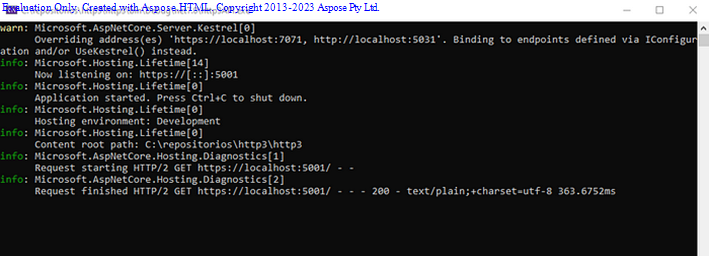

A tempos atrás publiquei um
artigo sobre&nbsp;<a href="https://www.linkedin.com/pulse/grpc-vs-rest-m%2525C3%2525A1rcio-kr%2525C3%2525BCger%3FtrackingId=BhdvY%252Fc%252FQU6CW%252FGvuA0Xgg%253D%253D/?trackingId=BhdvY%2Fc%2FQU6CW%2FGvuA0Xgg%3D%3D" target="_blank">gRPC vs Rest</a>&nbsp;e no artigo questionaram se seria
possível criar HTTP sem ser gRPC, então vamos lá.<o:p></o:p>

<b>O que é HTTP/3?<o:p></o:p></b>

Evaluation Only. Created with Aspose.HTML. Copyright 2013-2023 Aspose Pty Ltd. dos navegadores e servidores
modernos. Esta atualização deve trazer benefícios de desempenho principalmente
para usuários móveis ou conexões não confiáveis. A ideia principal é substituir
o TCP por um novo protocolo, o QUIC, que remove alguns problemas de TCP para
HTTP. Assim, o QUIC tem as seguintes vantagens (lista não exaustiva):<o:p></o:p>

·&nbsp;&nbsp;&nbsp;&nbsp;&nbsp;&nbsp;&nbsp;
Configuração de
conexão mais rápida combinando handshakes TCP e TLS<o:p></o:p>

·&nbsp;&nbsp;&nbsp;&nbsp;&nbsp;&nbsp;&nbsp;
Menos bloqueio
meio de uma melhor lógica de recuperação de perda de pacotes<o:p></o:p>

·&nbsp;&nbsp;&nbsp;&nbsp;&nbsp;&nbsp;&nbsp;
Migração de
conexão, para que você não precise se reconectar (handshake)
ao se mover entre redes (por exemplo, WIFI para celular)<o:p></o:p>

A partir do .NET 6 existe
suporte a HTTP/3 para clientes (incluindo gRPC e
servidores). Esta implementação baseia-se em HttpClientKestre
l&nbsp;<a href="https://github.com/microsoft/msquic" target="_blank">MsQuic</a>, é uma implementação da Microsoft do&nbsp;<a href="https://datatracker.ietf.org/wg/quic/about/" target="_blank">IETF QUIC</a>&nbsp;protocolo.
No momento, o .NET oferece suporte a HTTP/3 em:<o:p></o:p>

·&nbsp;&nbsp;&nbsp;&nbsp;&nbsp;&nbsp;&nbsp;
Windows 11 e
Windows Server 2022<o:p></o:p>

·&nbsp;&nbsp;&nbsp;&nbsp;&nbsp;&nbsp;&nbsp;
Linux (você
pode precisar instalar usando msquicapt install libmsquic)<o:p></o:p>

Caso utilize o .NET 6, talvez
esta funcionalidade ainda esteja em preview, portanto, você precisa habilitá-lo
explicitamente no csproj ou no código (EnablePreviewFeatures).<o:p></o:p>

&lt;PropertyGroup&gt; 
&nbsp;&nbsp;&nbsp; &lt;TargetFramework&gt;net6.0&lt;/TargetFramework&gt; 
&nbsp;&nbsp;&nbsp; &lt;Nullable&gt;enable&lt;/Nullable&gt; 
&nbsp;&nbsp;&nbsp; &lt;ImplicitUsings&gt;enable&lt;/ImplicitUsings&gt; 
&nbsp;&nbsp;&nbsp; &lt;EnablePreviewFeatures&gt;true&lt;/EnablePreviewFeatures&gt; 
&nbsp; &lt;/PropertyGroup&gt;<o:p></o:p>

<b>Criando API usando Servidor (Kestrel)<o:p></o:p></b>

Para criar uma API que tenha
suporte ao HTTP/3 você pode configurar o Kestrel para
escutar em HTTP/1, HTTP/2 e HTTP/3. É importante oferecer suporte a protocolos
mais antigos, pois nem todos os clientes oferecem suporte a protocolos mais
recentes. Além disso, HTTP/3 requer conexões seguras, então você deve usar o .UseHttps<o:p></o:p>

//Configurando HTTP3builder.WebHost.ConfigureKestrel((context,
options) =&gt; 
{ 
&nbsp;&nbsp;&nbsp; options.ListenAnyIP(5001, listenOptions =&gt; 
&nbsp;&nbsp;&nbsp; { 
&nbsp;&nbsp;&nbsp;&nbsp;&nbsp;&nbsp;&nbsp; listenOptions.Protocols
= HttpProtocols.Http1AndHttp2AndHttp3; 
&nbsp;&nbsp;&nbsp;&nbsp;&nbsp;&nbsp;&nbsp; listenOptions.UseHttps(); 
&nbsp;&nbsp;&nbsp; }); 
});<o:p></o:p>

E será necessário dar o using, caso seu editor já não o faça sozinho<o:p></o:p>

using
Microsoft.AspNetCore.Server.Kestrel.Core;<o:p></o:p>

Você também pode usar o log
do W3C e verificar a versão do protocolo usada pelo cliente:<o:p></o:p>

{ 
&nbsp; "DetailedErrors": true, 
&nbsp; "Logging": { 
&nbsp;&nbsp;&nbsp; "LogLevel": { 
&nbsp;&nbsp;&nbsp;&nbsp;&nbsp; "Default": "Information", 
&nbsp;&nbsp;&nbsp;&nbsp;&nbsp; "Microsoft.AspNetCore": "Warning", 
&nbsp;&nbsp;&nbsp;&nbsp;&nbsp; "Microsoft.AspNetCore.Hosting.Diagnostics": "Information" 
&nbsp;&nbsp;&nbsp; } 
&nbsp; }, 
&nbsp; "AllowedHosts": "*" 
}<o:p></o:p>

Ativando log na API W3C na
API:<o:p></o:p>

app.UseW3CLogging();<o:p></o:p>

Após subir a API e acessar a
API você vai ver o protocolo que está sendo consumindo<o:p></o:p>

<o:p></o:p>

<b>Criando um Client (HttpClient) C#<o:p></o:p></b>

HTTP/3 tem suporte no .NET 6
e .NET 7. Então, você precisa habilitar manualmente o recurso antes de usar
HTTP/3 em: HttpClient<o:p></o:p>

·&nbsp;&nbsp;&nbsp;&nbsp;&nbsp;&nbsp;&nbsp;
Editar a opção
para adicionar um tempo de execução csproj (System.Net.SocketsHttpHandler.Http3Support)<o:p></o:p>

&lt;Project Sdk="Microsoft.NET.Sdk"&gt; 
&nbsp;&nbsp;&nbsp; &lt;PropertyGroup&gt; 
&nbsp;&nbsp;&nbsp; &lt;OutputType&gt;Exe&lt;/OutputType&gt; 
&nbsp;&nbsp;&nbsp; &lt;TargetFramework&gt;net7.0&lt;/TargetFramework&gt; 
&nbsp;&nbsp;&nbsp; &lt;ImplicitUsings&gt;enable&lt;/ImplicitUsings&gt; 
&nbsp;&nbsp;&nbsp; &lt;Nullable&gt;enable&lt;/Nullable&gt; 
&nbsp;&nbsp;&nbsp; &lt;/PropertyGroup&gt; 
&nbsp;&nbsp;&nbsp; &lt;ItemGroup&gt; 
&nbsp;&nbsp;&nbsp;&nbsp;&nbsp;&nbsp; &nbsp;&nbsp;&nbsp;
&lt;RuntimeHostConfigurationOption
Include="System.Net.SocketsHttpHandler.Http3Support"  
&nbsp;&nbsp;&nbsp;&nbsp;&nbsp;&nbsp;&nbsp;&nbsp;&nbsp;&nbsp;&nbsp; Value="true"
/&gt; 
&nbsp;&nbsp;&nbsp;&nbsp;&nbsp; &lt;/ItemGroup&gt; 
&nbsp; &lt;/Project&gt;<o:p></o:p>

Defina a seguinte opção antes
de criar a primeira HttpClient<o:p></o:p>

System.AppContext.SetSwitch("System.Net.SocketsHttpHandler.Http3Support", true);<o:p></o:p>

Segue exemplo de código do Client<o:p></o:p>

using System.Net; 
 
System.AppContext.SetSwitch("System.Net.SocketsHttpHandler.Http3Support", true); 
try 
{ 
&nbsp;&nbsp;&nbsp; using var client = new
HttpClient() 
&nbsp;&nbsp;&nbsp; { 
&nbsp;&nbsp;&nbsp;&nbsp;&nbsp;&nbsp;&nbsp; DefaultRequestVersion =
HttpVersion.Version30, 
&nbsp;&nbsp;&nbsp;&nbsp;&nbsp;&nbsp;&nbsp; DefaultVersionPolicy =
HttpVersionPolicy.RequestVersionExact 
&nbsp;&nbsp;&nbsp; }; 
&nbsp;&nbsp;&nbsp; using var request = new
HttpRequestMessage(HttpMethod.Get, "https://localhost:5001/"); 
&nbsp;&nbsp;&nbsp; request.Version =
HttpVersion.Version30; 
&nbsp;&nbsp;&nbsp; request.VersionPolicy =
HttpVersionPolicy.RequestVersionExact; 
&nbsp;&nbsp;&nbsp; using var response = await
client.SendAsync(request); 
&nbsp;&nbsp;&nbsp; var data = await
response.Content.ReadAsStringAsync(); 
} 
catch(Exception e) 
{ 
&nbsp;&nbsp;&nbsp; Console.WriteLine(e.Message); 
}<o:p></o:p>

<b>Criando um Client JavaScript<o:p></o:p></b>

Lembrando que seu Windows e
navegador tem que ser compatível.<o:p></o:p>

fetch('https://localhost:5001/', { 
&nbsp;&nbsp;&nbsp; method: 'GET', 
&nbsp;&nbsp;&nbsp; headers: { 
&nbsp;&nbsp;&nbsp;&nbsp;&nbsp;&nbsp;&nbsp; 'Accept': 'application/json', 
&nbsp;&nbsp;&nbsp;&nbsp;&nbsp;&nbsp;&nbsp; 'Content-Type': 'application/json' 
&nbsp;&nbsp;&nbsp; }, 
&nbsp;&nbsp;&nbsp; protocol: 'http3', 
}) 
&nbsp;&nbsp;&nbsp; .then(response =&gt; { 
&nbsp;&nbsp;&nbsp;&nbsp;&nbsp;&nbsp;&nbsp; if (!response.ok) { 
&nbsp;&nbsp;&nbsp;&nbsp;&nbsp;&nbsp;&nbsp;&nbsp;&nbsp;&nbsp;&nbsp; throw new Error('Erro na internet'); 
&nbsp;&nbsp;&nbsp;&nbsp;&nbsp;&nbsp;&nbsp; } 
&nbsp;&nbsp;&nbsp;&nbsp;&nbsp;&nbsp;&nbsp; return response.json(); 
&nbsp;&nbsp;&nbsp; }) 
&nbsp;&nbsp;&nbsp; .then(data =&gt; { 
&nbsp;&nbsp;&nbsp;&nbsp;&nbsp;&nbsp;&nbsp; console.log(data); 
&nbsp;&nbsp;&nbsp; }) 
&nbsp;&nbsp;&nbsp; .catch(error =&gt; { 
&nbsp;&nbsp;&nbsp;&nbsp;&nbsp;&nbsp; &nbsp;console.error('Ocorreu um
erro:', error); 
&nbsp;&nbsp;&nbsp; });<o:p></o:p>

<b>Vantagens?<o:p></o:p></b>

Se você possuir um API
Gateway como centralizador dos seus Microserviços,
pode-se ter um ganho muito alto nas comunicações REST.<o:p></o:p>

Lembrando que a implementação
do lado da API, ativa o HTTP/3, mas caso o Client não
seja compatível, ele trabalha ainda com HTTP/2 e HTTP/1<o:p></o:p>

<b>Recursos adicionais<o:p></o:p></b>

<a href="https://github.com/marciokgr/http3" target="_blank">marciokgr/http3:
Projeto em .NET criando uma API utilizando HTTP/3 e um client
de comunicação utilizando também HTTP/3 (github.com)</a><o:p></o:p>

<a href="https://devblogs.microsoft.com/dotnet/dotnet-6-networking-improvements/?WT.mc_id=DT-MVP-5003978#http-3-and-quic" target="_blank">.NET 6
Networking Improvements — .NET Blog (microsoft.com)</a><o:p></o:p>

<o:p>&nbsp;</o:p>

